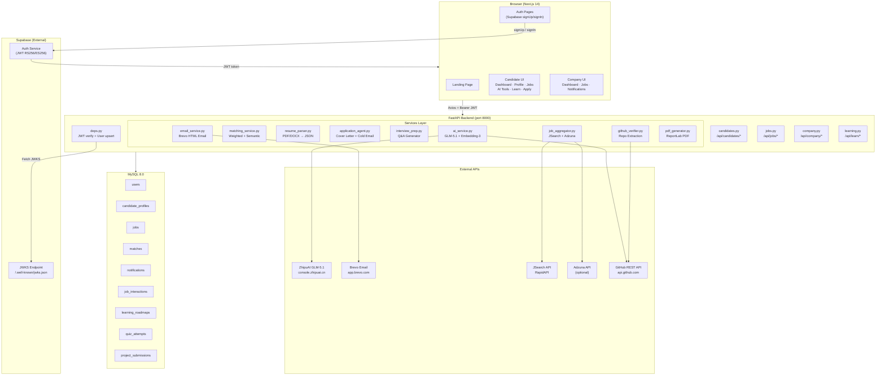
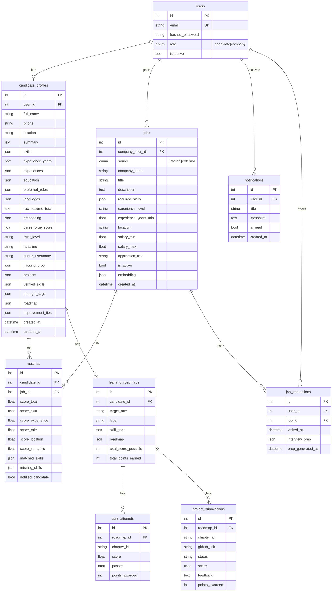
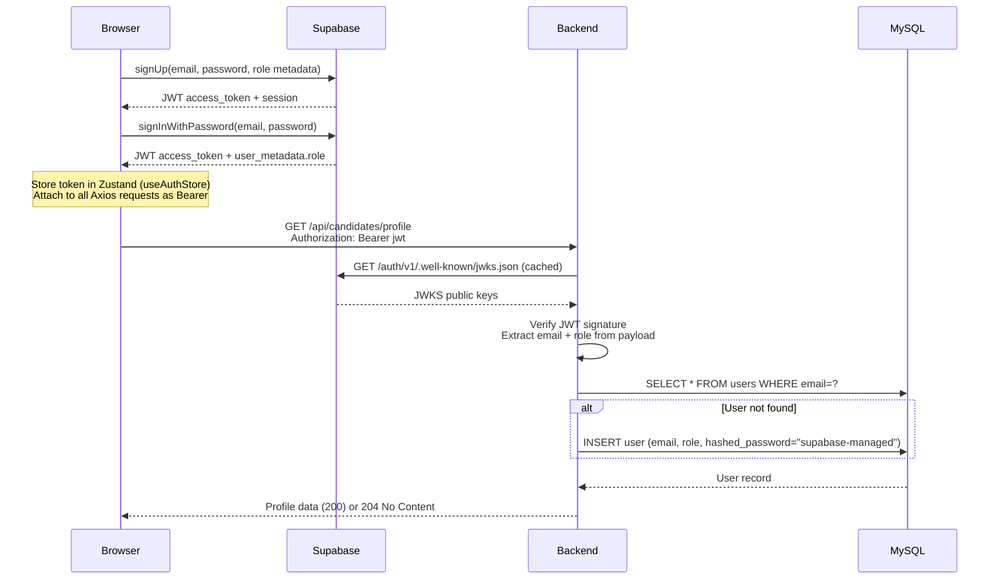
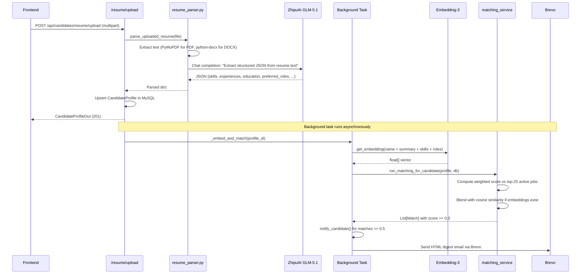
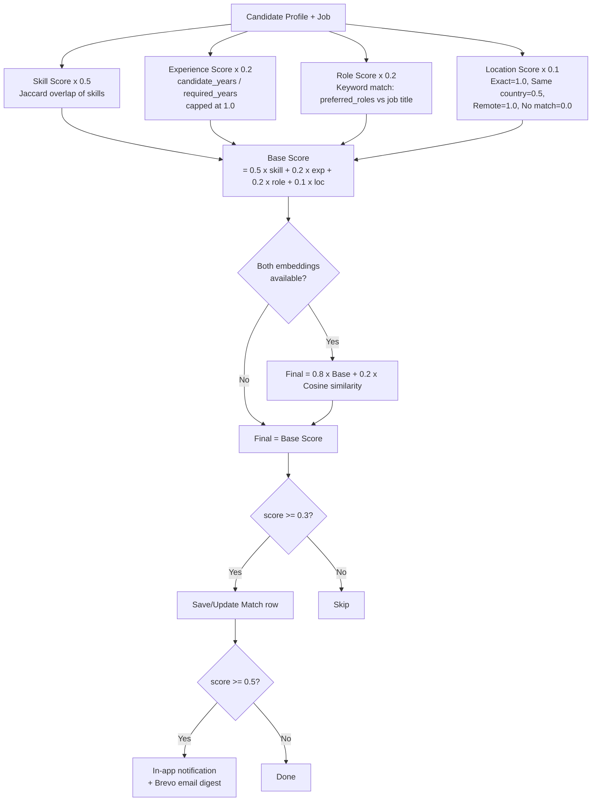
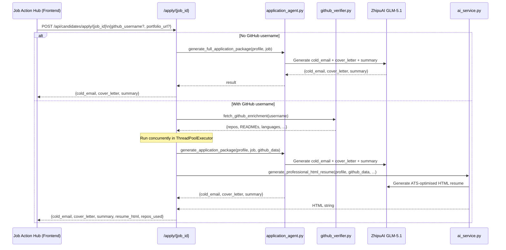
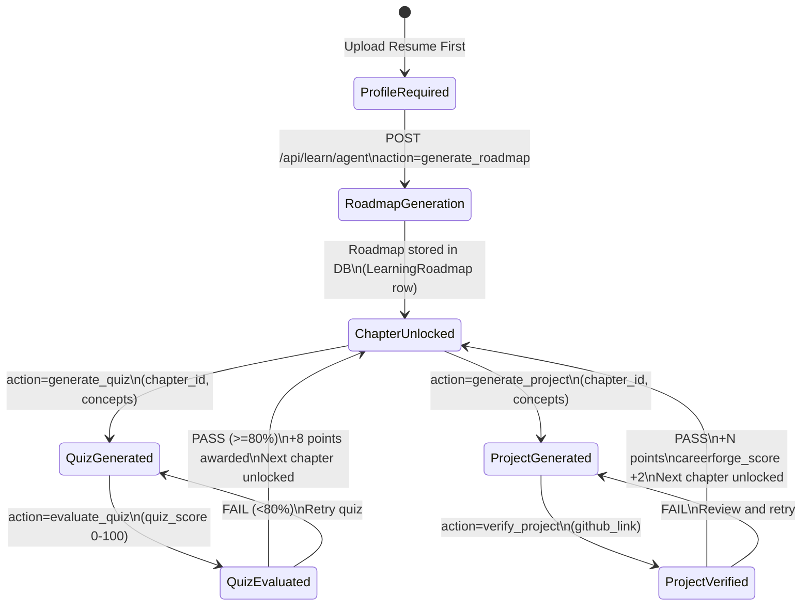
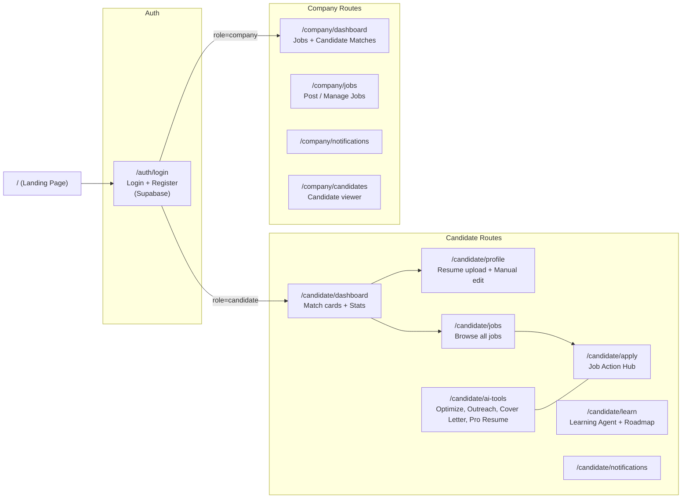

# CareerForge — Codebase Analysis Report
> Generated: 2026-04-25 | Analyzed by: Antigravity

---

## 1. Executive Summary

CareerForge is a **two-sided AI hiring platform** connecting candidates and companies. Candidates upload resumes, receive AI-powered career tools, and get automatically matched to jobs. Companies post jobs and see ranked candidate matches. The platform is built on a FastAPI + MySQL backend, a Next.js 14 frontend, and Supabase for authentication.

**Codebase health: Good** — well-structured, clearly separated layers, comprehensive AI feature set. A few areas need attention (see §11).

---

## 2. System Architecture

---

## 3. Data Model (ERD)

---

## 4. Authentication Flow

> **Key insight**: There are no custom `/api/auth/login` or `/api/auth/register` endpoints. Auth is fully delegated to Supabase. The backend acts as a JWT verifier only, and auto-provisions local user rows on first request for FK integrity.

---

## 5. Resume Upload & Parsing Flow

---

## 6. Matching Engine Deep Dive

---

## 7. AI Application Package Flow

---

## 8. Learning Agent State Machine

---

## 9. Frontend Page Map

---

## 10. Key Design Decisions

| Decision | Implementation | Rationale |
|---|---|---|
| **Auth delegation** | Supabase JWT — no custom auth endpoints | Offloads token lifecycle, email verification, and security complexity |
| **User upsert on first API call** | `deps.py` auto-creates local user row | Decouples Supabase user lifecycle from MySQL FK constraints |
| **Background tasks for embedding** | FastAPI `BackgroundTasks` | Keeps resume upload response fast; embedding is non-blocking |
| **JWKS caching** | Module-level `_jwks` global | Avoids fetching JWKS on every request (one HTTP call total) |
| **Embedding blend** | `0.8 × heuristic + 0.2 × semantic` | Heuristic is fast and deterministic; semantic adds quality when available |
| **Demo user shortcut** | `nxgextra@gmail.com` hardcoded returns | Allows demo without real resume/GLM calls |
| **Job limit cap** | `job_limit=25`, `candidate_limit=25` | Prevents O(N²) matching explosion on large datasets |
| **`extra="allow"` on ApplyPayload** | Accepts arbitrary extra fields | Prevents Pydantic validation error when frontend sends extra keys |

---

## 11. Issues & Recommendations

### 🔴 Critical

| # | Issue | Location | Fix |
|---|---|---|---|
| 1 | **Duplicate route `/search-jobs`** | `candidates.py` lines 463 & 670 | Remove the second definition; FastAPI silently uses the first |
| 2 | **Duplicate route `/apply/{job_id}`** | `candidates.py` lines 372 (async) & 615 (sync) | Remove the sync version at line 615; the async one is newer and more capable |
| 3 | **JWKS race condition** | `deps.py` — `_jwks` global mutable, no lock | Use `threading.Lock()` or `functools.lru_cache` |
| 4 | **DB session in background task** | `_embed_and_match()` — `SessionLocal()` called in thread | Currently safe (try/finally), but consider a context manager pattern |

### 🟡 Medium

| # | Issue | Location | Recommendation |
|---|---|---|---|
| 5 | **`auth.py` not registered** | `app/api/auth.py` exists but never imported in `main.py` | Remove file or add an explanation comment |
| 6 | **CORS wildcard** | `main.py` — `allow_origins=["*"]` | Switch to `settings.ALLOWED_ORIGINS` (already defined in config) |
| 7 | **Hardcoded demo email** | 9 occurrences of `nxgextra@gmail.com` in `candidates.py` | Move to `settings.DEMO_USER_EMAIL` |
| 8 | **No pagination on job list** | `GET /api/jobs` | Add `skip` + `limit` query params |

### 🟢 Improvements

| # | Suggestion | Benefit |
|---|---|---|
| 9 | Configure Alembic migrations (already in `requirements.txt`) | Safe schema changes without dropping tables |
| 10 | Add response models to all endpoints | Better Swagger docs and type safety |
| 11 | Rate-limit GLM API calls | Prevent cost runaway if users spam AI endpoints |
| 12 | Cache `fetch_github_enrichment` results (1h TTL) | GitHub API rate limit protection |
| 13 | Frontend: loading skeletons + error boundaries | Better UX during slow AI calls (6–15s) |

---

## 12. Dependency Overview

### Backend (`requirements.txt`)

| Package | Version | Purpose |
|---|---|---|
| `fastapi` | 0.111.0 | Web framework |
| `uvicorn` | 0.29.0 | ASGI server |
| `sqlalchemy` | 2.0.30 | ORM |
| `alembic` | 1.13.1 | Migrations (installed, not configured) |
| `pymysql` | 1.1.1 | MySQL driver |
| `pydantic` | 2.7.1 | Schema validation |
| `pydantic-settings` | 2.2.1 | Config from `.env` |
| `python-jose` | 3.3.0 | JWT verification |
| `httpx` | 0.27.0 | Async HTTP (Supabase JWKS, Brevo, GitHub) |
| `openai` | 1.30.1 | ZhipuAI client (OpenAI-compatible API) |
| `pymupdf` | 1.25.5 | PDF text extraction |
| `python-docx` | 1.1.2 | DOCX text extraction |
| `scikit-learn` | 1.6.1 | Cosine similarity |
| `numpy` | 2.2.6 | Vector math |
| `reportlab` | 4.2.2 | PDF generation |
| `jinja2` | 3.1.4 | Email HTML templates |
| `bcrypt` | 4.0.1 | Password hashing (legacy — unused with Supabase) |

### Frontend (key packages)

| Package | Purpose |
|---|---|
| `next` 14 | React framework + file-based routing |
| `@supabase/supabase-js` | Auth client |
| `axios` | HTTP client with JWT interceptor |
| `zustand` | Global auth state store |
| `react-hook-form` + `zod` | Form validation |
| `lucide-react` | Icon library |
| `tailwindcss` | Utility CSS |

---

## 13. Performance Characteristics

| Operation | Typical Latency | Notes |
|---|---|---|
| Resume upload → response | ~200ms | Parser async; embedding/matching runs in background |
| GLM chat completion | 2–8s | Depends on ZhipuAI server load |
| Embedding generation | 1–3s | Single API call |
| Matching (25 jobs) | <50ms | Pure Python, in-memory |
| GitHub enrichment | 1–4s | Multiple REST calls per repo |
| Application package (no GitHub) | 4–10s | One GLM call |
| Application package (with GitHub) | 6–15s | Two concurrent GLM calls + GitHub fetch |
| Interview prep (cached) | <10ms | Pure DB read |
| Interview prep (fresh) | 5–12s | GLM call, then cached in `job_interactions` |

---

## 14. Security Notes

- ✅ JWT verified against Supabase JWKS (RS256/ES256)
- ✅ Role-based route guards: `require_candidate` / `require_company`
- ✅ No secrets in frontend code (all via env vars)
- ✅ Input validation via Pydantic v2 on all endpoints
- ⚠️ `allow_origins=["*"]` should be restricted in production
- ⚠️ No rate limiting on AI endpoints — cost exposure risk
- ⚠️ No input sanitization on `job_description` before GLM prompt injection (low risk in current context)
- ℹ️ `hashed_password="supabase-managed"` for Supabase users — correct pattern, just undocumented
